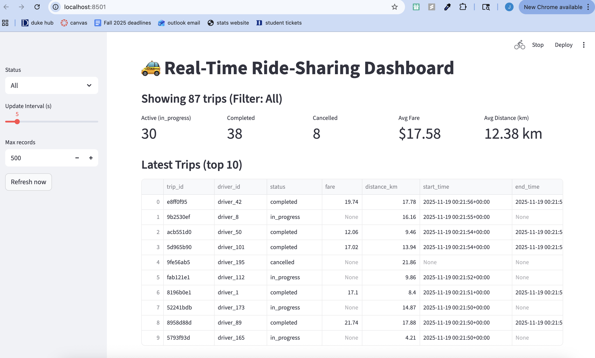
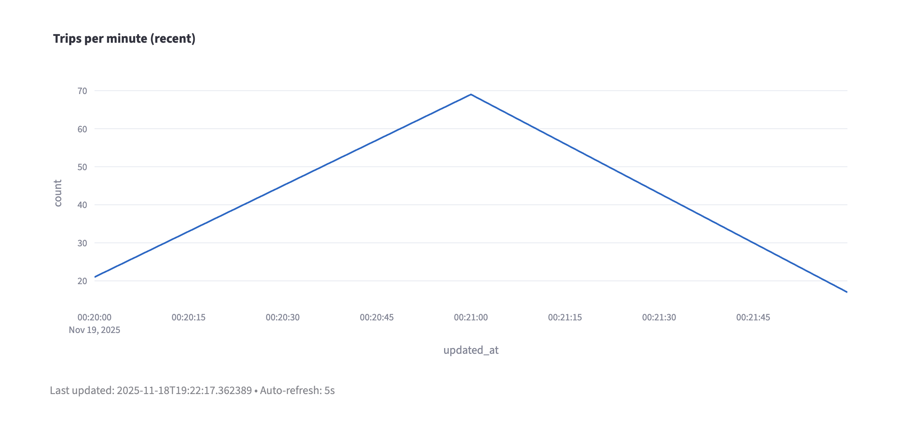

# Real-Time Trips Streaming Pipeline

This project implements a real-time data streaming system using Apache Kafka, PostgreSQL, and Streamlit, customized for ride-sharing trip events.

This system generates synthetic trip data, streams it through Kafka, and stores it in PostgreSQL, and visualizes it in a live dashboard.

## Project Overview

### Pipeline Components
- Trips producer -> generates synthetic trip events
- Kafka Broker -> streams events in real time
- Trips Consumer -> inserts trip events into PostgreSQL
- PostgreSQL -> stores all trip records
- Streamlit Dashboard -> live visualization of trips

### Synthetic Trip Event Schema:

{
  "trip_id": "a93b12cd",
  "driver_id": "DR123",
  "rider_id": "RD984",
  "pickup_city": "Chicago",
  "dropoff_city": "Chicago",
  "distance_km": 12.4,
  "fare_usd": 24.75,
  "rating": 4.8,
  "timestamp": "2025-01-01T12:30:45"
}

## Setup Instructions

1. Clone the repository using git clone link
2. Install the requirements:
   
pip install -r requirements.txt

3. Launch Docker Services:

docker-compose up -d
sleep 30
docker ps

4. Create Kafka Topic for Trips:

docker exec -it kafka kafka-topics \
  --create \
  --topic trips \
  --bootstrap-server localhost:9092 \
  --partitions 1 \
  --replication-factor 1
5. Open three different terminals, all within the project folder

- In terminal 1, run the consumer: python trips_consumer.py
- In terminal 2, run the producer: python trips_producer.py
- In terminal 3, run the dashboard: streamlit run trips_dashboard.py

## Dashboard Features

The streamlit dashboard displays:

- Total trips
- Total fare revenue
- Average distance
- Trips by pickup/dropoff city
- Ratings distribution
- Time-series of incoming trips
- Auto-refresh every 5 seconds

## Screenshots

Dashboard running:

Graph display:

